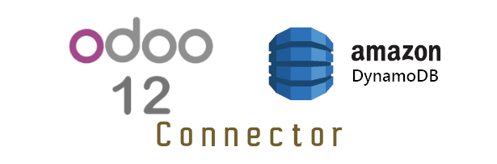

Reads DynamoDB from Odoo
======================================

This project aim to provide a module installable in Odoo 12 in order to connect to your DynamoDb AWS

 - Reads config from a Table that you configure in Odoo
 - Test the connection throught this Test table
 - You can configure the parameters in the Json file
 - To have a requirements.txt file that can be edit by adding the records in the requirements.txt in this project

 How to

## Prerequisites:
 - To have an EC2 Amazon Server where to Run Odoo
 - To have, inside this EC2, the "credentials" file inside the hidden folder .aws 
 - To have created, in Amazon Web Services, the DynamoDB table "Test"
 
 ## Install
First, install your virtual Environment for Python

`virtualenv --python=python3 ERP_CONNECTOR`

`source ERP_CONNECTOR/bin/activate`

`pip install -r requirements.txt`

Test the connection using the test_connection file, that reads the parameter you put, 
inside the /static/configuration/configuration_test.json file.

This is just a way to test the connection, you can run this file directly
inside Pycharm.
